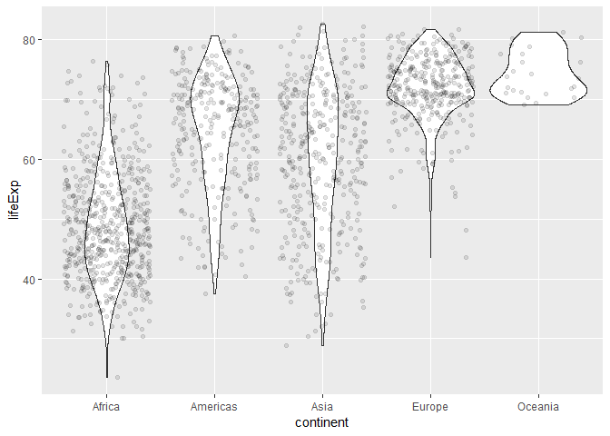
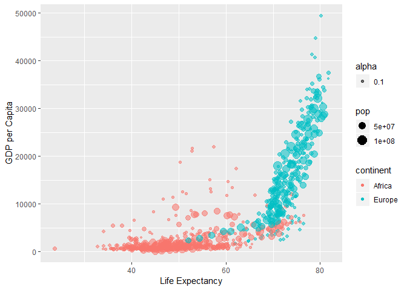

Homework 02: Explore Gapminder and use dplyr
================
Stephen Chignell
September 24, 2018

Overview
--------

The following exercise explores the **gapminder** dataset using a number of tools in R. Below is a list of some helpful resources to refer to throughout this exercise (and in the future!):

-   [Markdown Cheat Sheet](https://github.com/adam-p/markdown-here/wiki/Markdown-Cheatsheet)
-   [R Markdown Cheat Sheet](https://www.rstudio.com/wp-content/uploads/2016/03/rmarkdown-cheatsheet-2.0.pdf)
-   [Dplyr Cheat Sheet](https://www.rstudio.com/wp-content/uploads/2015/02/data-wrangling-cheatsheet.pdf)
-   [Useful Dplyr Functions](https://www.r-bloggers.com/useful-dplyr-functions-wexamples/)
-   [ggplot2 Cheat Sheet](https://www.rstudio.com/wp-content/uploads/2015/03/ggplot2-cheatsheet.pdf)
-   [R Language Definition](https://stat.ethz.ch/R-manual/R-devel/doc/manual/R-lang.html#Objects)

Preparation
-----------

### Load Packages

Note: The tidyverse package includes the dplyr package!

``` r
#install.packages("tidyverse")
#install.packages("ggplot2")
library(tidyverse)
```

    ## -- Attaching packages -------------------------------------------------- tidyverse 1.2.1 --

    ## v ggplot2 3.0.0     v purrr   0.2.5
    ## v tibble  1.4.2     v dplyr   0.7.6
    ## v tidyr   0.8.1     v stringr 1.3.1
    ## v readr   1.1.1     v forcats 0.3.0

    ## -- Conflicts ----------------------------------------------------- tidyverse_conflicts() --
    ## x dplyr::filter() masks stats::filter()
    ## x dplyr::lag()    masks stats::lag()

``` r
library(ggplot2)
```

### Load the data

``` r
library(gapminder)
```

### Get familiar

It's always a good idea to check the data, to make sure it's loading correctly and is what you think it is.

The `head` function is a great way to do this. It returns the first 6 rows by default, or you can specify a number. Let's look at the first 10 rows:

``` r
head(gapminder, 10)
```

    ## # A tibble: 10 x 6
    ##    country     continent  year lifeExp      pop gdpPercap
    ##    <fct>       <fct>     <int>   <dbl>    <int>     <dbl>
    ##  1 Afghanistan Asia       1952    28.8  8425333      779.
    ##  2 Afghanistan Asia       1957    30.3  9240934      821.
    ##  3 Afghanistan Asia       1962    32.0 10267083      853.
    ##  4 Afghanistan Asia       1967    34.0 11537966      836.
    ##  5 Afghanistan Asia       1972    36.1 13079460      740.
    ##  6 Afghanistan Asia       1977    38.4 14880372      786.
    ##  7 Afghanistan Asia       1982    39.9 12881816      978.
    ##  8 Afghanistan Asia       1987    40.8 13867957      852.
    ##  9 Afghanistan Asia       1992    41.7 16317921      649.
    ## 10 Afghanistan Asia       1997    41.8 22227415      635.

The `tail` function is the same, but starts from the bottom of the dataset:

``` r
tail(gapminder, 10)
```

    ## # A tibble: 10 x 6
    ##    country  continent  year lifeExp      pop gdpPercap
    ##    <fct>    <fct>     <int>   <dbl>    <int>     <dbl>
    ##  1 Zimbabwe Africa     1962    52.4  4277736      527.
    ##  2 Zimbabwe Africa     1967    54.0  4995432      570.
    ##  3 Zimbabwe Africa     1972    55.6  5861135      799.
    ##  4 Zimbabwe Africa     1977    57.7  6642107      686.
    ##  5 Zimbabwe Africa     1982    60.4  7636524      789.
    ##  6 Zimbabwe Africa     1987    62.4  9216418      706.
    ##  7 Zimbabwe Africa     1992    60.4 10704340      693.
    ##  8 Zimbabwe Africa     1997    46.8 11404948      792.
    ##  9 Zimbabwe Africa     2002    40.0 11926563      672.
    ## 10 Zimbabwe Africa     2007    43.5 12311143      470.

### Take a closer look

Let's dig deeper into `gapminder`.

#### 1. What type of object is it?

``` r
typeof(gapminder) 
```

    ## [1] "list"

#### 2. What is its class?

``` r
class(gapminder)
```

    ## [1] "tbl_df"     "tbl"        "data.frame"

More information about this class is available [here](https://blog.rstudio.com/2016/03/24/tibble-1-0-0).

#### 3. How many columns/variables?

``` r
ncol(gapminder)
```

    ## [1] 6

#### 4. How many rows/observations?

``` r
nrow(gapminder)
```

    ## [1] 1704

You could also use the `dim` function:

``` r
dim(gapminder) # `dim` stands for "dimensions""
```

    ## [1] 1704    6

### A more "structured" approach

You could also use `str` function to answer many of the previous questions:

``` r
str(gapminder) # `str` stands for "structure"
```

    ## Classes 'tbl_df', 'tbl' and 'data.frame':    1704 obs. of  6 variables:
    ##  $ country  : Factor w/ 142 levels "Afghanistan",..: 1 1 1 1 1 1 1 1 1 1 ...
    ##  $ continent: Factor w/ 5 levels "Africa","Americas",..: 3 3 3 3 3 3 3 3 3 3 ...
    ##  $ year     : int  1952 1957 1962 1967 1972 1977 1982 1987 1992 1997 ...
    ##  $ lifeExp  : num  28.8 30.3 32 34 36.1 ...
    ##  $ pop      : int  8425333 9240934 10267083 11537966 13079460 14880372 12881816 13867957 16317921 22227415 ...
    ##  $ gdpPercap: num  779 821 853 836 740 ...

Notice that `str` also includes variable names, types, and examples of the data in each. This approach might be good as an initial check, but could also be overwhelming if you were only interested in knowing one aspect of the data.

Variable exploration
--------------------

Let's explore how life expectancy varies across continents.

#### Select out one of each type of variable:

``` r
cvsl <-select(gapminder, continent, lifeExp, pop) #Factor, #Number, and #Integer, respectively
cvsl # continents vs life expectancy
```

    ## # A tibble: 1,704 x 3
    ##    continent lifeExp      pop
    ##    <fct>       <dbl>    <int>
    ##  1 Asia         28.8  8425333
    ##  2 Asia         30.3  9240934
    ##  3 Asia         32.0 10267083
    ##  4 Asia         34.0 11537966
    ##  5 Asia         36.1 13079460
    ##  6 Asia         38.4 14880372
    ##  7 Asia         39.9 12881816
    ##  8 Asia         40.8 13867957
    ##  9 Asia         41.7 16317921
    ## 10 Asia         41.8 22227415
    ## # ... with 1,694 more rows

#### Conduct a basic `summary` of the data:

``` r
summary(cvsl)
```

    ##     continent      lifeExp           pop           
    ##  Africa  :624   Min.   :23.60   Min.   :6.001e+04  
    ##  Americas:300   1st Qu.:48.20   1st Qu.:2.794e+06  
    ##  Asia    :396   Median :60.71   Median :7.024e+06  
    ##  Europe  :360   Mean   :59.47   Mean   :2.960e+07  
    ##  Oceania : 24   3rd Qu.:70.85   3rd Qu.:1.959e+07  
    ##                 Max.   :82.60   Max.   :1.319e+09

Here we can see that there are **5 unique classes** (factors) included in the continent variable.

The mininum life expectancy across all continents is **22.60**, and the max is **82.60**.

The minimum population is **60,010** and the maximum population is **1,319,000,000**.

Those are both very large ranges! Let's visualize them with a violin plot.

#### Violin plot

Use ggplot2 to generate a violin plot and overlay some jittered points:

``` r
ggplot(cvsl, aes(continent, lifeExp))+
  geom_violin()+
  geom_jitter(alpha=0.1)
```



Interesting, we can see that, in the data period (1952-2007), there is a fairly large range for each continent, with the exception of Oceania. In fact, Oceania is on par with Europe, and is the only continent with a life expectancy completely above 65.

Perhaps *this* is a factor?


### Filtering the data

Suppose we wanted to visualize the relationship between **Life Expectancy** and **Gross Domestic Product per capita** in Europe and Africa over the last 50 years that we have data for:

We can do this through filtering and piping the data into ggplot:

#### Filter the data

``` r
select(gapminder, gdpPercap, lifeExp, pop, year, continent) %>% #subsetting data
  filter(year > 1957, continent=="Europe"|continent=="Africa") %>% #filter by criteria
  ggplot(aes(lifeExp, gdpPercap))+ #piped to ggplot
  geom_point(aes(color=continent, size=pop, alpha=0.1)) + # add aesthetics 
  xlab("Life Expectancy")+
  ylab("GDP per Capita")
```



Here we can see that most people in Africa tend to live much shorter lives, with less income, than people in Europe.

Still, we can see that this isn't a hard split. There are some clear outliers in both continents, and a fairly large overlap between the healthier, wealthier Africans and Europeans on the lower ends of the two scales.

Let's work for more overlap (preferably in the top right corner) in the next 50 years!

### Extra thoughts

Perhaps an analyst wants to filter the data just to Rwanda and Afghanistan. Did they succeed with the following code?

``` r
filter(gapminder, country == c("Rwanda", "Afghanistan"))
```

    ## # A tibble: 12 x 6
    ##    country     continent  year lifeExp      pop gdpPercap
    ##    <fct>       <fct>     <int>   <dbl>    <int>     <dbl>
    ##  1 Afghanistan Asia       1957    30.3  9240934      821.
    ##  2 Afghanistan Asia       1967    34.0 11537966      836.
    ##  3 Afghanistan Asia       1977    38.4 14880372      786.
    ##  4 Afghanistan Asia       1987    40.8 13867957      852.
    ##  5 Afghanistan Asia       1997    41.8 22227415      635.
    ##  6 Afghanistan Asia       2007    43.8 31889923      975.
    ##  7 Rwanda      Africa     1952    40    2534927      493.
    ##  8 Rwanda      Africa     1962    43    3051242      597.
    ##  9 Rwanda      Africa     1972    44.6  3992121      591.
    ## 10 Rwanda      Africa     1982    46.2  5507565      882.
    ## 11 Rwanda      Africa     1992    23.6  7290203      737.
    ## 12 Rwanda      Africa     2002    43.4  7852401      786.

While the above seems correct, it is unsuccessful because `c()` returns only data with the combination of the two countries. The correct way to do this is to use `|`.

``` r
filter(gapminder, country=="Rwanda"|country=="Afghanistan")
```

    ## # A tibble: 24 x 6
    ##    country     continent  year lifeExp      pop gdpPercap
    ##    <fct>       <fct>     <int>   <dbl>    <int>     <dbl>
    ##  1 Afghanistan Asia       1952    28.8  8425333      779.
    ##  2 Afghanistan Asia       1957    30.3  9240934      821.
    ##  3 Afghanistan Asia       1962    32.0 10267083      853.
    ##  4 Afghanistan Asia       1967    34.0 11537966      836.
    ##  5 Afghanistan Asia       1972    36.1 13079460      740.
    ##  6 Afghanistan Asia       1977    38.4 14880372      786.
    ##  7 Afghanistan Asia       1982    39.9 12881816      978.
    ##  8 Afghanistan Asia       1987    40.8 13867957      852.
    ##  9 Afghanistan Asia       1992    41.7 16317921      649.
    ## 10 Afghanistan Asia       1997    41.8 22227415      635.
    ## # ... with 14 more rows

Notice the much larger amount of data returned in the second filtering operation!
